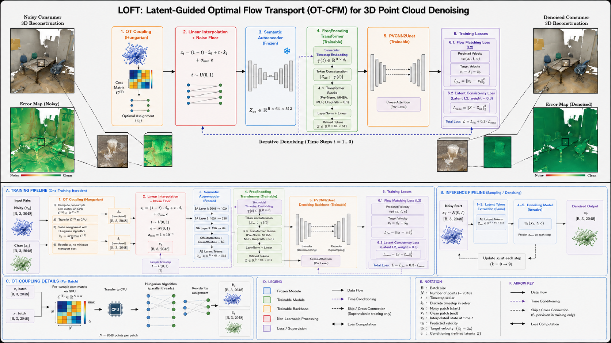

<p align="center">
  <h1 align="center">LOFT: Latent-Guided Optimal Flow Transport for 3D Point Cloud Denoising</h1>
  <p align="center">
    <strong>Latent-conditioned OT-CFM for PUNet and ScanNet++</strong>
  </p>
</p>
<p align="center">
  <a href="./assets/overview.png">
    
  </a>
</p>

<br>

LOFT replaces the diffusion Schrodinger bridge used in P2P-Bridge with Optimal Transport Conditional Flow Matching (OT-CFM) and adds a learned latent conditioning pathway. A frozen SemanticAutoencoder encodes noisy geometry into latent tokens, a FreqEncodingTransformer refines those tokens as a function of time, and the PVCNN2Unet backbone consumes them through multi-level cross-attention.

This repository contains two LOFT branches:

- PUNet synthetic object denoising via `configs/PVDS_PUNet_latent.yaml`
- ScanNet++ real indoor scene denoising via `configs/PVDL_SNPP_latent.yaml`

Both branches are denoising-only. They process overlapping patches and merge them back to the original point count. There is no output upsampling stage.

## Requirements

The code was tested with Python 3.10, PyTorch 2.5.1+cu121, CUDA 12.1, and Ubuntu 22.04.

Create a conda environment:

```bash
conda create -n loft python=3.10
conda activate loft
```

Install PyTorch first:

```bash
conda install pytorch==2.5.1 torchvision pytorch-cuda=12.1 -c pytorch -c nvidia --yes
```

Then install the remaining dependencies and compile the CUDA extensions:

```bash
sh install.sh
```

## Data Preparation

### Object data: PUNet

The PUNet branch expects the synthetic object data under the directory configured by `data.data_dir` in `configs/PVDS_PUNet_latent.yaml`. The active config in this repo points to `/mnt/zone/B/NEW/P2B_latent_DDPM/data`, with the following structure:

```bash
data/
├── 10000_poisson/
├── 30000_poisson/
└── 50000_poisson/
```

The denoising model works patch-wise with `npoints: 2048` and merges overlapping predictions back to the original point count with FPS.

If you use `evaluate_objects.py` for benchmark evaluation, you can also point it to a separate test-set layout with `--data_path` and `--dataset_root`, following the original P2P-Bridge object evaluation format.

### Indoor scenes: ScanNet++

The ScanNet++ branch uses real iPhone scans plus per-point DINO features. The active training config is `configs/PVDL_SNPP_latent.yaml`.

The expected components are:

```bash
/mnt/zone/A/scannetpp_release_realtrain/data
/mnt/zone/A/P2B_latent_DDPM/snpp_real_dino_processed/<scene>/features/dino_iphone.npy
/mnt/zone/A/P2B_latent_DDPM/snpp_real_processed_iphone_dino_500k
```

To build the processed training batches from raw ScanNet++ data, use:

```bash
conda run -n deepfill python data/preprocess_batches.py \
  --data_root /mnt/zone/A/scannetpp_release_realtrain/data \
  --output_root /mnt/zone/A/P2B_latent_DDPM/snpp_real_processed_iphone_dino_500k \
  --feature_type none \
  --use_iphone_dino_ply
```

For evaluation, the provided script reads scene ids from `splits/snpp_test_valid.txt` and expects each scene folder to contain `scans/iphone_dino.ply`.

## Training

To train the PUNet LOFT model:

```bash
python train.py --config configs/PVDS_PUNet_latent.yaml
```

Important PUNet settings:

- bridge: latent OT-CFM
- batch size: 32
- steps: 450000
- save interval: 25000
- AE checkpoint: `/mnt/zone/B/NEW/P2B_latent_DDPM/checkpoints_ae_retrain_v3/ae_epoch_675.pth`
- `latent_film: true`

To train the ScanNet++ LOFT model:

```bash
CUDA_VISIBLE_DEVICES=1 PYTHONUNBUFFERED=1 python -u train.py --config configs/PVDL_SNPP_latent.yaml
```

Important ScanNet++ settings:

- bridge: latent OT-CFM
- batch size: 4
- steps: 250000
- save interval: 10000
- scheduler: `CosineAnnealingLR`
- AE checkpoint: `/mnt/zone/A/P2B_latent_DDPM/checkpoints_ae_snpp_real/ae_best_clean_cd.pth`
- per-point DINO features enabled via `extra_feature_channels: 384`
- `latent_film: false`

For all available training arguments, run:

```bash
python train.py --help
```

## Checkpoints

This repository uses the following checkpoint layout:

```bash
checkpoints/
├── otcfm_latent/
│   └── step_*.pth
└── PVDL_SNPP_latent/
    ├── opt.yaml
    └── step_*.pth
```

The object branch uses checkpoints from `checkpoints/otcfm_latent/`. The ScanNet++ branch uses checkpoints from `checkpoints/PVDL_SNPP_latent/`.

## Evaluation

### PUNet objects

To evaluate the PUNet LOFT model on object data:

```bash
python evaluate_objects.py \
  --model_path checkpoints/otcfm_latent/step_200000.pth \
  --dataset PUNet \
  --use_ema \
  --steps 10
```

Outputs are written under `output_objects/<dataset>/` together with the evaluation summaries.

To denoise a single `.xyz` object file:

```bash
python denoise_object.py \
  --data_path test.xyz \
  --save_path output.xyz \
  --model_path checkpoints/otcfm_latent/step_200000.pth \
  --use_ema \
  --steps 10
```

### ScanNet++ indoor scenes

To denoise the 4-scene ScanNet++ evaluation subset with the provided script:

```bash
bash scripts/denoise_snpp.sh \
  /mnt/zone/A/P2B_latent_DDPM/snpp_evaluation \
  checkpoints/PVDL_SNPP_latent/step_250000.pth \
  1
```

This script:

- reads scene ids from `splits/snpp_test_valid.txt`
- denoises each `scans/iphone_dino.ply`
- writes predictions to `predictions_dino/P2SB/`
- runs `evaluate_rooms.py --dataset snpp --suffix _dino`

To run room evaluation manually:

```bash
python evaluate_rooms.py --data_root /mnt/zone/A/P2B_latent_DDPM/snpp_evaluation --dataset snpp --suffix _dino
```

To summarize the per-scene metrics table:

```bash
python scripts/summarize_snpp_metrics.py \
  --data_root /mnt/zone/A/P2B_latent_DDPM/snpp_evaluation \
  --scene_file splits/snpp_test_valid.txt \
  --suffix _dino \
  --latent_pattern "250000_10_ema"
```

## Denoise Your Own Data

### Real-world room scan

To denoise a room point cloud:

```bash
python denoise_room.py \
  --room_path <ROOM_PATH>/scans/iphone_dino.ply \
  --model_path checkpoints/PVDL_SNPP_latent/step_250000.pth \
  --out_path <ROOM_PATH>/predictions_dino/P2SB/output.ply \
  --steps 10 \
  --k 4
```

By default the script looks for DINO features at:

```bash
<ROOM_PATH>/features/dino_iphone.npy
```

You can change the feature file stem with `--feature_name`.

### Synthetic object point cloud

To denoise a single synthetic object point cloud in `.xyz` format:

```bash
python denoise_object.py \
  --data_path <INPUT_XYZ> \
  --save_path <OUTPUT_XYZ> \
  --model_path checkpoints/otcfm_latent/step_200000.pth \
  --use_ema \
  --steps 10
```

## Architecture

The main LOFT components are:

- `models/flow_bridge.py`: `OTFlowBridge` and `LatentOTFlowBridge`
- `models/autoencoder.py`: frozen SemanticAutoencoder
- `models/freq_encoding_transformer.py`: timestep-conditioned latent refinement
- `models/unet_pvc.py`: PVCNN2Unet backbone with latent write-attention
- `models/model_loader.py`: model construction and checkpoint loading

The core conditioning pipeline is:

```text
noisy input -> SemanticAutoencoder -> latent tokens -> FreqEncodingTransformer(t) -> PVCNN2Unet cross-attention -> velocity field
```

For a more detailed technical description, see `TECHNICAL_SUMMARY.txt` and `architecture.md`.

## Repository Structure

```bash
configs/        PUNet and ScanNet++ training configs
data/           preprocessing utilities and dataset helpers
dataloaders/    dataset loading code
metrics/        Chamfer and point-to-face evaluation
models/         OT-CFM bridge, AE, transformer, PVCNN backbone
scripts/        evaluation and helper scripts
splits/         train, val, and evaluation scene lists
third_party/    external CUDA and point cloud libraries
utils/          shared utilities
```

## Notes

- PUNet and ScanNet++ use different AE checkpoints and different conditioning settings.
- PUNet keeps `latent_film: true`; ScanNet++ disables it and uses DINO features.
- Both branches use Euler ODE sampling with 10 function evaluations at inference.
- The ScanNet++ room evaluation pipeline in this repo targets the 4-scene subset listed in `splits/snpp_test_valid.txt`.

## Acknowledgements

This repository uses the PVCNN architecture and custom point cloud evaluation utilities. The LOFT latent OT-CFM formulation, SemanticAutoencoder integration, and FreqEncodingTransformer conditioning pipeline are implemented in this codebase.
